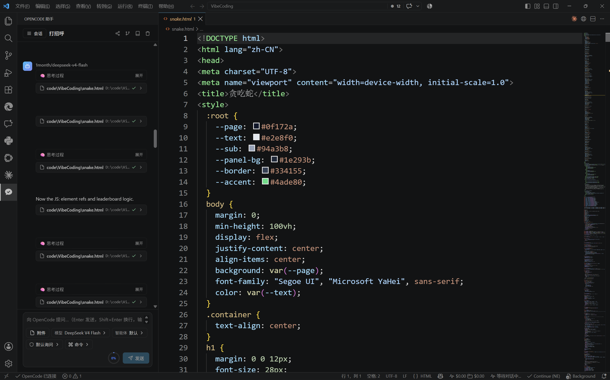

# OpenCode Assistant（OpenCode 助手）

> GitHub: [github.com/dboycht/opencodeguiplugin](https://github.com/dboycht/opencodeguiplugin) · VS Code Marketplace: `dboycht.opencode-gui-plugin`

OpenCode Assistant brings [OpenCode](https://opencode.ai) into VS Code as a **graphical, non-terminal** interface — with conversation management, model switching, tool-call visualization, approval modes and more. Think Cline / Continue / Copilot Chat, powered by opencode.

> How it works: the extension starts (or connects to) a local `opencode serve` backend and talks to it over the official HTTP/SSE APIs, so it reuses all of opencode's sessions, models, agents, permissions and tools.

---

## Screenshot / 界面预览



---

## Features / 功能特性

- **Graphical interface** — full Webview GUI (English / 中文), no terminal needed.
- **First-run onboarding** — detects whether `opencode` is installed; if not, offers one-click install; lets you pick your interface language.
- **Conversation management** — session list with search; create / rename / delete / fork / switch; share links; summarize; revert any message.
- **Streaming chat** — real-time token streaming with Markdown, syntax highlighting and one-click code copy.
- **Thinking preview** — live reasoning stream in a sliding window during generation.
- **Tool-call visualization** — bash / read / edit / search / webfetch calls with live status and expandable output.
- **Approval modes (Claude-style)** — Ask / Accept edits / Accept all / Plan mode; graphical allow-once / always-allow / reject prompts.
- **Plan review** — after a plan finishes, an approval panel lists each changed file with **View diff / Apply / Reject**.
- **Context ring** — live token usage vs. the model's context window.
- **Usage records** — per-session tokens (input/output/reasoning/cache), tool-call count and cost.
- **First-token latency & timing** — shown in a sticky activity bar with a Stop button.
- **`@` file reference** — type `@` to search and attach workspace files.
- **Input history** — ↑/↓ to reuse previous prompts.
- **Slash commands** — type `/` to browse and run all native opencode commands.
- **Model / agent pickers** — grouped, searchable.
- **Persistence** — remembers your model, agent, approval mode, language and last session.
- **Theme aware** — follows VS Code light/dark themes.

---

## Installation / 安装

### Prerequisites / 前置要求

1. [OpenCode](https://opencode.ai) installed (`opencode` on PATH). The extension offers **one-click install** during first-run if it's missing.
2. At least one provider configured via `opencode auth login`.

### Install from VSIX / 本地安装

```bash
npm install -g @vscode/vsce
npm run package      # generates opencode-gui-plugin-<ver>.vsix
```

Then in VS Code: Extensions → `…` → **Install from VSIX…** → select the `.vsix`.

### Develop locally / 本地开发

```bash
npm install
npm run watch        # watch build
# press F5 in VS Code → "Run Extension"
```

---

## Usage / 使用说明

1. Click the **OpenCode icon in the activity bar** (or `Ctrl+Shift+P` → `OpenCode: Open Chat`).
2. First run: choose language (English / 中文); the extension checks for opencode and offers one-click install if needed.
3. Session list on the left — `+` to create a new session; `☰` to collapse/expand (narrow windows auto-collapse).
4. Pick a model & agent below the input box, type, press `Enter` to send (`Shift+Enter` for a newline).
5. Type `@` to attach a workspace file, or `/` to run a command.
6. Select code in the editor → run `OpenCode: Add selection to chat` or `OpenCode: Explain selection`.

---

## Configuration / 配置

Search `opencode` in VS Code settings:

| Key | Default | Description |
| --- | --- | --- |
| `opencode.commandPath` | `opencode` | opencode executable path / command name |
| `opencode.hostname` | `127.0.0.1` | server hostname |
| `opencode.port` | `4096` | server port |
| `opencode.autoStart` | `true` | auto-start server on activation |
| `opencode.connectMode` | `auto` | `auto` spawns the server; `manual` connects to an existing one |
| `opencode.defaultModel` | `""` | default model (`provider/model`) |
| `opencode.uiLanguage` | `en` | interface language |

---

## FAQ / 常见问题

- **Server auth**: if `OPENCODE_SERVER_PASSWORD` is set, the extension reads it automatically (username defaults to `opencode`).
- **Shared sessions**: sessions live in opencode's local DB — the extension and the TUI see the same list.
- **Cannot connect**: make sure `opencode` is installed and on PATH; or set `opencode.connectMode` to `manual` with the right port.

---

## Project Structure / 项目结构

```
plugin/
├── src/                  # Extension (Node) side
│   ├── extension.ts      # entry: commands, status bar, lifecycle
│   ├── manager.ts        # opencode server lifecycle (spawn serve / connect)
│   ├── client.ts         # opencode HTTP client + SSE event parsing
│   ├── panel.ts          # webview host + message protocol dispatch
│   ├── protocol.ts       # extension ↔ webview protocol
│   └── types.ts          # opencode API types (subset)
├── webview/              # Webview (browser) side
│   ├── App.tsx           # root component + event dispatch
│   ├── store.ts          # signal-based state (@preact/signals)
│   ├── i18n.ts           # en / zh localization
│   ├── api.ts            # postMessage bridge
│   ├── markdown.ts       # markdown + syntax highlighting
│   └── ...               # Onboarding / Sidebar / Chat / MessageView / ToolCall / Composer…
├── assets/screenshots/   # screenshots
├── esbuild.js            # build script (extension + webview)
└── media/icon.svg        # icon
```

## Tech Stack / 技术栈

- TypeScript + esbuild (bundles extension & webview)
- Preact + `@preact/signals`
- markdown-it + highlight.js
- opencode official HTTP / SSE APIs (zero runtime deps, native `fetch`)

## License

MIT
